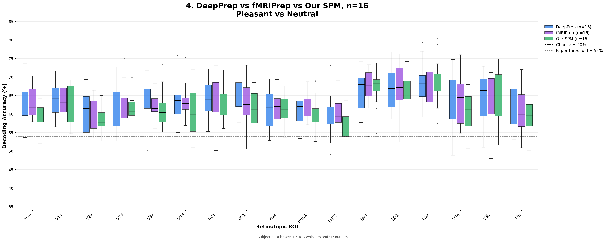
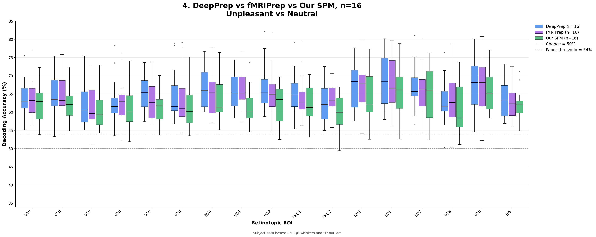

# Bo2021 Affective MVPA

Replication and preprocessing-comparison workflow for Bo et al. (2021),
"Decoding Neural Representations of Affective Scenes in Retinotopic Visual
Cortex." The repository contains scripts and derived result artifacts for
building a BIDS dataset, running fMRIPrep and DeepPrep, estimating single-trial
betas, decoding affective scene valence from retinotopic ROIs, validating group
effects, and generating comparison figures.

## Results At A Glance

The primary comparison holds the cohort (`n=16`) and downstream analysis
constant while varying the preprocessing pipeline. DeepPrep and fMRIPrep data
were conformed to the native SPM/Wang-atlas grid, then all three pipelines were
analyzed with 6-confound LSS beta estimation and balanced LIBSVM decoding with
training-fold-only scaling.



*Pleasant vs. Neutral. Boxes summarize subject-level decoding accuracy for the
matched 16-subject cohort.*



*Unpleasant vs. Neutral. The same subjects, ROIs, classifier, and downstream
analysis are used for each preprocessing pipeline.*

Across both contrasts, the three pipelines recover broadly similar ROI
profiles with substantial overlap in their subject-level distributions.
Decoding is generally strongest in lateral visual regions such as `hMT`, `LO1`,
and `LO2`, while differences among pipelines are smaller than the
between-subject spread visible in most ROIs. The dashed lines mark chance
(50%) and the statistical threshold reported in Bo et al. (54%); the boxplots
are descriptive comparisons rather than tests of pipeline superiority.

## What This Repository Does

The analysis asks whether retinotopic visual cortex contains decodable
information about affective scene categories, and how decoding results compare
across preprocessing pipelines.

The main comparisons are:

- Published Bo et al. (2021) Figure 3B estimates
- Original/legacy SPM-style decoding results
- Recomputed SPM results
- DeepPrep results conformed to native SPM space
- fMRIPrep results conformed to native SPM space

The core decoding contrasts are:

- Pleasant vs. Neutral
- Unpleasant vs. Neutral

The primary ROI set includes `V1v`, `V1d`, `V2v`, `V2d`, `V3v`, `V3d`, `hV4`,
`VO1`, `VO2`, `PHC1`, `PHC2`, `hMT`, `LO1`, `LO2`, `V3a`, `V3b`, and `IPS`.

## Repository Layout

```text
.
|-- data/                         # Placeholder for local/raw/intermediate data
|-- logs/                         # Runtime logs
|-- references/                   # Paper PDF and reference material
|-- results/
|   |-- 01_our_deepprep_fmriprep_lss_spmspace/
|   |-- 02_max_spm_results/
|   |-- 03_our_spm_results/
|   |-- 04_papers_results/
|   |-- plots/
`-- scripts/
    |-- 00_preprocessing/
    |-- 01_beta_estimation/
    |-- 02_beta_extraction/
    |-- 03_decoding/
    |-- 04_group_validation/
    `-- plotting/
```

## Included Artifacts

This repo includes code plus selected derived outputs:

- MATLAB decoding result files in `results/01_*`, `results/02_*`, and
  `results/03_*`
- Digitized paper Figure 3B estimates in `results/04_papers_results/`
- Final grouped comparison PNGs in `results/plots/`
- A copy of the Bo et al. paper in `references/`

Raw imaging data, full preprocessing derivatives, beta images, and large
intermediate products are expected to live outside the repository.

## Requirements

Python scripts use a scientific Python stack:

```bash
python -m pip install numpy scipy matplotlib pandas pyyaml nibabel h5py joblib scikit-learn statsmodels
```

MATLAB stages require:

- MATLAB
- SPM12 on the MATLAB path
- Statistics and Machine Learning Toolbox for `fitcsvm` modes
- LIBSVM on the MATLAB path for LIBSVM modes

Preprocessing/HPC stages additionally assume:

- SLURM
- fMRIPrep
- DeepPrep container/Singularity
- FreeSurfer license
- `bids-validator`

Many cluster scripts contain HiPerGator-style paths such as
`/orange/ruogu.fang/pateld3/data`. Override these with environment variables
where supported, or edit the path block before running on another system.

## Data And Subject Conventions

The BIDS conversion script assumes a 16-subject matched cohort. Original
subjects `Sub10`-`Sub13` lacked T1 anatomical images and were excluded. The
remaining subjects are renumbered as:

```text
sub-001..sub-009  -> Sub01..Sub09
sub-010..sub-016  -> Sub14..Sub20
```

The task has five runs per subject. Each run contains pleasant, neutral, and
unpleasant IAPS trials.

## Pipeline Overview

| Stage | Folder | Purpose |
| --- | --- | --- |
| 00 | `scripts/00_preprocessing/` | Create BIDS dataset and submit fMRIPrep/DeepPrep jobs |
| 01 | `scripts/01_beta_estimation/` | Estimate LSA/LSS first-level beta-series models |
| 02 | `scripts/02_beta_extraction/` | Extract LSS beta images into condition matrices |
| 03 | `scripts/03_decoding/` | Run ROI-level SVM decoding and merge subject results |
| 04 | `scripts/04_group_validation/` | Run group-level permutation/statistical validation |
| Plot | `scripts/plotting/` | Generate grouped final comparison figures |

## Reproducing The Results

The results are easiest to recreate in three passes:

1. Recreate the published/legacy SPM reference results.
2. Generate this repository's SPM, DeepPrep, and fMRIPrep results.
3. Place the result MAT files in the expected folders and generate the
   comparison figures.

The commands below assume the repository root is the current directory.
Imaging derivatives and beta images are intentionally written outside the
repository; only final MAT files, reports, and figures belong under `results/`.

### A. Recreate The Published And Legacy Results

The paper-level inputs in `results/04_papers_results/` are digitized
five-number summaries from Bo et al. Figure 3B. They are comparison reference
data, not outputs that can be recomputed from this repository alone:

```text
results/04_papers_results/
|-- Bo2021_Figure3B_pleasant_vs_neutral_estimates.mat
`-- Bo2021_Figure3B_unpleasant_vs_neutral_estimates.mat
```

To recreate the legacy SPM/LSS decoding represented by
`results/02_max_spm_results/`, start with the original SPM-preprocessed BOLD,
motion files, onset MAT files, and Wang atlas masks. The legacy MATLAB scripts
contain Windows workstation paths, so update their path blocks first.

Run one LSS GLM per trial:

```matlab
addpath('/path/to/spm12');
run('scripts/01_beta_estimation/lss/BetaS2LSS.m');
```

Restore presentation order and collect each condition into voxels-by-trials
matrices:

```matlab
addpath('/path/to/spm12');
run('scripts/02_beta_extraction/BetaSingleTrialLSS_correctedindexing.m');
```

Run the four historical decoder variants after updating `data_dir`, `roiDir`,
and `save_file` in each script:

```matlab
run('scripts/03_decoding/ROI_Decoding_Parallelized_LIBSVM.m');
run('scripts/03_decoding/ROI_Decoding_Parallelized_LIBSVM_Unbalanced.m');
run('scripts/03_decoding/ROI_Decoding_Parallelized_SampleBalanced.m');
run('scripts/03_decoding/ROI_Decoding_Parallelized_SampleUnBalanced.m');
```

The primary legacy comparison uses the balanced LIBSVM output:

```text
results/02_max_spm_results/DecodingResults_LIBSVM_v5.mat
```

These scripts preserve the historical analysis behavior, including global
z-scoring in the LIBSVM variants. They are useful for replication; the
foldwise-scaled decoder below is preferred for the new analysis.

### B. Recreate Our Results

#### B1. DeepPrep And fMRIPrep Results

Create and preprocess the matched 16-subject BIDS cohort using Sections 1 and
2 below. Next, conform each pipeline's BOLD data to the native SPM/Wang-mask
grid. `TEMPLATE_XFM` can be supplied explicitly; otherwise the script queries
TemplateFlow.

```bash
export DATA_ROOT=/path/to/data
export LSS_ROOT=/path/to/data/LSS
export SPM_SPACE_REF=/path/to/data/LSS/masks/maxprob_vol_lh_1.nii

bash scripts/01_beta_estimation/lss/conform_preproc_to_spm_space.sh deepprep
bash scripts/01_beta_estimation/lss/conform_preproc_to_spm_space.sh fmriprep
```

Estimate and extract 6-confound LSS betas. On SLURM, submit the beta jobs first
and wait for all 16 array tasks before running extraction:

```bash
sbatch scripts/01_beta_estimation/lss/slurm/run_betalss_deepprep_spmspace_6conf.sbatch
sbatch scripts/01_beta_estimation/lss/slurm/run_betalss_fmriprep_spmspace_6conf.sbatch

sbatch scripts/02_beta_extraction/slurm/run_extract_deepprep_spmspace_6conf.sbatch
sbatch scripts/02_beta_extraction/slurm/run_extract_fmriprep_spmspace_6conf.sbatch
```

Run all classifier/fold combinations with training-fold-only scaling:

```bash
sbatch scripts/03_decoding/slurm/run_decode_spmspace_6conf_no_global_zscore.sbatch
```

The comparison figures use these two balanced LIBSVM files:

```text
DecodingResults_deepprep_spmspace_6conf_libsvm_balanced_sub16.mat
DecodingResults_fmriprep_spmspace_6conf_libsvm_balanced_sub16.mat
```

Place the eight generated DeepPrep/fMRIPrep files in:

```text
results/01_our_deepprep_fmriprep_lss_spmspace/
```

#### B2. Recomputed SPM Results

Use the extracted native-SPM `Pl#`, `Nt#`, and `Up#` matrices and the same Wang
atlas masks with the foldwise-scaled unified decoder:

```matlab
addpath('/path/to/spm12');
addpath('scripts/03_decoding');
addpath(genpath('/path/to/libsvm/matlab'));

opts = struct();
opts.data_dir = '/path/to/spm/lss_extracted/spm_6conf';
opts.roiDir = '/path/to/spm/masks';
opts.out_dir = '/path/to/our_spm_results';
opts.ncpu = 16;

ROI_Decoding_Complete_foldwise_zscore( ...
    'libsvm', 'balanced', 'spm', 6, 'auto', opts);
```

The `auto` cohort setting writes both outputs needed for comparison:

```text
DecodingResults_spm_6conf_libsvm_balanced_all20.mat
DecodingResults_spm_6conf_libsvm_balanced_sub16.mat
```

Repeat with `fitcsvm` and/or `unbalanced` to recreate the full result matrix,
then place the generated files in:

```text
results/03_our_spm_results/
```

### C. Recreate The Comparisons

Before plotting, the following inputs must exist:

```text
results/01_our_deepprep_fmriprep_lss_spmspace/
results/02_max_spm_results/
results/03_our_spm_results/
results/04_papers_results/
```

Generate all ten comparison figures from the repository root:

```bash
python scripts/plotting/generate_grouped_comparison_plots.py
```

The command validates its MAT inputs before plotting and writes both contrasts
for five source combinations to `results/plots/`. Run the group validation and
outputs also need to be regenerated.

## 1. Create A BIDS Dataset

`scripts/00_preprocessing/create_bids_dataset.py` converts raw NIfTI folders and
MATLAB onset files into a BIDS-like dataset for the emotion task.

```bash
python scripts/00_preprocessing/create_bids_dataset.py \
  --input-dir /path/to/raw/sub-folders \
  --output-dir /path/to/bids \
  --onset-dir /path/to/NewStimuluesSetting
```

Optional subject subset:

```bash
python scripts/00_preprocessing/create_bids_dataset.py \
  --input-dir /path/to/raw/sub-folders \
  --output-dir /path/to/bids \
  --onset-dir /path/to/NewStimuluesSetting \
  --subjects 001 002 003
```

Then validate:

```bash
bids-validator /path/to/bids --ignoreWarnings
```

## 2. Run Preprocessing

Template SLURM scripts are provided for both preprocessing pipelines:

- `scripts/00_preprocessing/slurm/fmriprep.sbatch`
- `scripts/00_preprocessing/slurm/deepprep.sbatch`

Before submitting, edit or export:

- `FREESURFER_LICENSE`
- `BIDS_DIR`
- `OUTPUT_DIR`
- `WORK_DIR` for fMRIPrep
- `TEMPLATEFLOW_HOME` for fMRIPrep
- `DEEPPREP_PATH` and `NXF_HOME` for DeepPrep

Example:

```bash
sbatch scripts/00_preprocessing/slurm/fmriprep.sbatch
sbatch scripts/00_preprocessing/slurm/deepprep.sbatch
```

## 3. Estimate Single-Trial Betas

The beta-estimation scripts are split into LSA and LSS branches.

LSA scripts:

- `scripts/01_beta_estimation/lsa/BetaS2.m`
- `scripts/01_beta_estimation/lsa/BetaS2_fmriprep.m`
- `scripts/01_beta_estimation/lsa/BetaS2_deepprep.m`

LSS scripts:

- `scripts/01_beta_estimation/lss/BetaS2LSS.m`
- `scripts/01_beta_estimation/lss/BetaLSS_spmspace.m`
- `scripts/01_beta_estimation/lss/conform_preproc_to_spm_space.sh`

For the current SPM-space LSS branch, conformed DeepPrep/fMRIPrep BOLD is
expected at:

```text
<LSS_ROOT>/conformed_spmspace/<pipeline>/sub-XXX/func/
```

Then run MATLAB, for example:

```matlab
addpath('/path/to/spm12');
addpath('scripts/01_beta_estimation/lss');
BetaLSS_spmspace('deepprep', 6);
BetaLSS_spmspace('fmriprep', 6);
```

SLURM wrappers:

- `scripts/01_beta_estimation/lss/slurm/run_betalss_deepprep_spmspace_6conf.sbatch`
- `scripts/01_beta_estimation/lss/slurm/run_betalss_fmriprep_spmspace_6conf.sbatch`

## 4. Extract LSS Betas

`scripts/02_beta_extraction/extract_lss_spmspace.m` extracts SPM-space LSS beta
images into condition matrices:

- `Pl#.mat`
- `Nt#.mat`
- `Up#.mat`

Example:

```matlab
addpath('/path/to/spm12');
addpath('scripts/02_beta_extraction');
extract_lss_spmspace('deepprep', 6);
extract_lss_spmspace('fmriprep', 6);
```

SLURM wrappers:

- `scripts/02_beta_extraction/slurm/run_extract_deepprep_spmspace_6conf.sbatch`
- `scripts/02_beta_extraction/slurm/run_extract_fmriprep_spmspace_6conf.sbatch`

## 5. Run ROI Decoding

The current MATLAB decoder is:

```text
scripts/03_decoding/ROI_Decoding_Complete_foldwise_zscore.m
```

It supports:

- Classifier: `fitcsvm` or `libsvm`
- Fold method: `balanced` or `unbalanced`
- Pipeline: `deepprep`, `fmriprep`, `spm`, or full config strings
- Cohort: `auto`, `sub16`, or `all20`

Example MATLAB call:

```matlab
addpath('/path/to/spm12');
addpath('scripts/03_decoding');
addpath(genpath('/path/to/libsvm/matlab'));

opts = struct();
opts.data_root = '/path/to/LSS';
opts.data_dir = fullfile(opts.data_root, 'lss_extracted_spmspace', 'deepprep_spmspace_6conf');
opts.roiDir = fullfile(opts.data_root, 'masks');
opts.out_dir = fullfile(opts.data_root, 'lss_decoding_results_spmspace_no_global_zscore');
opts.ncpu = 16;

ROI_Decoding_Complete_foldwise_zscore('libsvm', 'balanced', ...
    'deepprep_spmspace_6conf', 6, 'sub16', opts);
```

The array wrapper runs all DeepPrep/fMRIPrep combinations for SPM-space,
6-confound, no-global-z-score decoding:

```bash
sbatch scripts/03_decoding/slurm/run_decode_spmspace_6conf_no_global_zscore.sbatch
```

There is also a Python port of the single-subject decoder:

```bash
python scripts/03_decoding/decode_subject.py \
  --subject 3 \
  --data-dir /path/to/betas \
  --roi-masks-file /path/to/roi_masks.mat \
  --output-dir /path/to/results \
  --n-jobs 8
```

Merge Python per-subject outputs:

```bash
python scripts/03_decoding/merge_results.py \
  --output-dir /path/to/results \
  --num-subjects 20
```

## 6. Group-Level Validation

`scripts/04_group_validation/group_level_validation.py` performs group-level
permutation testing with checkpoint support. It expects a decoding `.mat` file
with accuracy arrays and, when available, per-subject null distributions.

```bash
python scripts/04_group_validation/group_level_validation.py \
  --results-file /path/to/decoding_results.mat \
  --output-dir /path/to/group_validation \
  --checkpoint-dir /path/to/group_validation/checkpoints \
  --n-permutations 100000 \
  --checkpoint-interval 5000 \
  --alpha 0.001 \
  --comparison both
```

SLURM wrapper:

```bash
sbatch scripts/04_group_validation/slurm/run_group_validation.sbatch
```

## 7. Generate Final Comparison Plots

The committed final figures are in `results/plots/`.

```text
results/plots/
|-- 01_paper_vs_max_vs_our_spm_n20_pleasant_vs_neutral.png
|-- 01_paper_vs_max_vs_our_spm_n20_unpleasant_vs_neutral.png
|-- 02_paper_vs_max_vs_our_spm_n16_pleasant_vs_neutral.png
|-- 02_paper_vs_max_vs_our_spm_n16_unpleasant_vs_neutral.png
|-- 03_deepprep_vs_fmriprep_vs_max_spm_n16_pleasant_vs_neutral.png
|-- 03_deepprep_vs_fmriprep_vs_max_spm_n16_unpleasant_vs_neutral.png
|-- 04_deepprep_vs_fmriprep_vs_our_spm_n16_pleasant_vs_neutral.png
|-- 04_deepprep_vs_fmriprep_vs_our_spm_n16_unpleasant_vs_neutral.png
|-- 05_deepprep_vs_fmriprep_vs_paper_pleasant_vs_neutral.png
`-- 05_deepprep_vs_fmriprep_vs_paper_unpleasant_vs_neutral.png
```

The plotting script is:

```bash
python scripts/plotting/generate_grouped_comparison_plots.py
```

It reads MATLAB result files, draws ROI-level grouped boxplots, and writes PNG
figures. If you move result directories or regenerate from a different folder,
check the path constants near the top of the script before running.

## Key Result Directories

- `results/01_our_deepprep_fmriprep_lss_spmspace/`: DeepPrep/fMRIPrep
  SPM-space LSS decoding results with 6 confounds and the matched 16-subject
  cohort
- `results/02_max_spm_results/`: legacy comparison SPM result files
- `results/03_our_spm_results/`: recomputed SPM result files for all-20 and
  matched-16 cohorts
- `results/04_papers_results/`: digitized Bo et al. Figure 3B group estimates
- `results/plots/`: final grouped comparison figures

## Notes For Reuse

- The scripts are written as analysis workflow code, not as an installable
  Python package.
- Several MATLAB and SLURM files contain absolute paths from the original HPC
  environment. Treat these as templates and update paths before submitting jobs.
- The raw data and heavyweight derivatives are not tracked here.
- The `results/` directory contains derived artifacts useful for comparison and
  inspection without rerunning the full imaging pipeline.

## Citation

If you use this workflow, cite the original study:

Bo K, Yin S, Liu Y, Hu Z, Meyyappan S, Kim S, Keil A, Ding M. 2021. Decoding
Neural Representations of Affective Scenes in Retinotopic Visual Cortex.
*Cerebral Cortex*, 31(6):3047-3063.
https://doi.org/10.1093/cercor/bhaa411
